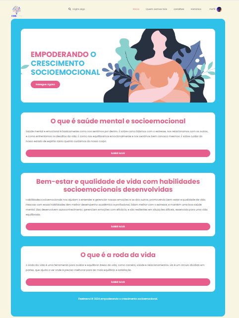

⚠️EM CONSTRUÇÃO⚠️

## Qual a intenção do grupo

A intenção do grupo é promover o desenvolvimento e o empoderamento das habilidades socioemocionais dos usuários. Isso inclui fortalecer competências como empatia, autoconhecimento, habilidades de comunicação e resolução de conflitos. Nosso objetivo é ajudar os indivíduos a melhorarem suas interações pessoais e profissionais, contribuindo para uma sociedade mais colaborativa e resiliente.  

## Oque motivou nossa escolha

Escolhemos focar nas habilidades socioemocionais porque acreditamos que elas são fundamentais para o bem-estar e sucesso pessoal e profissional. Observamos que muitas pessoas enfrentam desafios relacionados a emoções e relacionamentos que impactam negativamente suas vidas. Queremos fornece ferramentas e recursos para que elas possam lidar melhor com essas questões e alcançar seu pleno potencial.

## Qual a sua importância

O empoderamento das habilidades socioemocionais é crucial porque estas habilidades afetam todos os aspectos da vida cotidiana, desde a capacidade de gerenciar o estresse até a habilidade de formar e manter relacionamentos saudáveis. Ao fortalecer essas competências, ajudamos os indivíduos a se tornarem mais resilientes, a melhorar suas habilidades interpessoais e a aumentar sua autoestima, o que, por sua vez, contribui para uma comunidade mais coesa e solidária.   

  
  ## Quem somos
  O Feelmend é seu aliado no crescimento socioemocional. Oferecemos recursos como materiais, tarefas, jogos e dicas para melhorar sua comunicação, autoestima e muito mais. Avance na autoconfiança e habilidades interpessoais de forma divertida e eficaz. Explore e encontre o equilíbrio que você merece!

## Missão e valores

Nossos valores são honestidade, transparência, inovação, responsabilidade social, e respeito. Agimos com integridade, mantemos clareza, buscamos melhorar continuamente, apoiamos causas e práticas sustentáveis, e promovemos um ambiente inclusivo e respeitador.
Nossa missão é empoderar habilidades socioemocionais queremos ajudar as pessoas a melhorar suas relações e decisões, contribuindo para uma sociedade mais justa e colaborativa.

## Público alvo

Nosso site foi desenvolvido especialmente para aqueles que se identificam com João e enfrentam desafios diários como estresse, instabilidade emocional, dificuldades de comunicação e conflitos interpessoais.
Compreendemos como é difícil enfrentar essas questões sozinho então nosso site de empoderamento de habilidades socioemocionais está aqui para ajudar você a superar esses desafios!  

## Nosso diferencial
1 - Desenvolvemos habilidades socioemocionais;  

2 - Jogos interativos que ajudam de forma espontânea e criativa;

3 - Proporcionar um ambiente e uma rotina de autoconhecimento

4 - Melhorar a comunicação interpessoal sobre seus sentimentos

# Login

